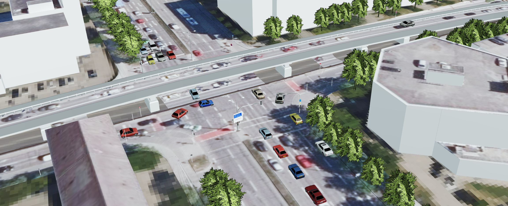

# Converting SUMO traffic simulation results to CZML
These Python scripts read [SUMO](https://sumo.dlr.de/docs/FAQ.html) traffic simulation results from the [FCD (floating car data)](https://sumo.dlr.de/docs/Simulation/Output/FCDOutput.html) export in the CSV format and convert it to the [Cesium Language (CZML)](https://github.com/AnalyticalGraphicsInc/czml-writer/wiki/CZML-Guide), which is a JSON-based format for describing time-dynamic geospatial data. The output CZML file can be visualized in the [Cesium](https://cesium.com/platform/cesiumjs/) virtual globe and combined with semantic 3D city models using the [3DCityDB](https://www.3dcitydb.org/3dcitydb/) [Web-Map-Client](https://www.3dcitydb.org/3dcitydb/3dwebclient/).

## Usage
### sumo2czml_points.py
This script creates point representations for each traffic member. The function *convert_to_czml* takes the following parameters:

- input_file (str): the path to the input CSV file (e.g. *'./input/sumo_fcd_sample.csv'*).
- output_file (str): the path to the output CZML file (e.g. *'./output/czml_points_sample.czml'*).
- start_date (datetime): the start date of the simulation (e.g. *datetime(2023, 1, 1, 0, 0, 0)*).
- current_time (float): the current time in seconds since the start of the simulation (e.g. *180*).  

The input CSV file should have the following structure, where all values are stored in the first column of the CSV file, separated with commas and "." as a delimiter for decimal values.  

| timestep   [s]     | id       |  x [°]         |      y  [°]     |  z  [m]     | type  |
| ----------- | ----------- | ----------- | ----------- | ---------|---------|
| 0.0      | id_car_1          |   11.56     |   48.13     | 510.2 | passenger      |
| 1.0      | id_car_1          |   11.57     |   48.14     | 510.1 |passenger     |
| ...     | ...          |   ...     |   ...     |  ...     | ... | ...|


- *timestep* describes the timestep between individual positions of traffic members. The timestep values should start at 0. A timestep of 1 second is recommended.  
- *id* contains the id of individual traffic members.
- *x* contains the absolute x-coordinate (longitude) of the traffic member given as geodetic coordinates. 
- *y* contains the absolute y-coordinate (latitude) of the traffic member given as geodetic coordinates.
- *z* contains the absolute z-coordinate (height above the ground) in meters of the traffic member at a certain position. If no *z* column is available, the height value in the CZML output is set to zero.
- *type* contains information on the type of traffic member. Individual colors of point representations are assigned per [default SUMO *type* parameter](https://sumo.dlr.de/docs/Vehicle_Type_Parameter_Defaults.html). Non-default traffic member types are represented using white points. Colors can be adapted and generic traffic types can be added in the *get_vehicle_color* function.

### sumo2czml_3Dmodels.py
In addition to the information specified above, this script requires *angle* (and optionally *slope*) values from the FCD output. This information is used to orient 3D models on the Cesium virtual globe depending on longitude, latitude and local orientation of traffic members. Traffic members of *type* passenger are assigned to a demo 3D model, provided by [Cesium](https://github.com/CesiumGS/cesium/tree/main/Apps/SampleData/models/CesiumMilkTruck). Additionally, traffic members of type *pedestrian* are assigned to an animated person called *CesiumMan*, which is also [provided by Cesium](https://github.com/CesiumGS/cesium/tree/main/Apps/SampleData/models/CesiumMan). Other 3D models can be referenced by adapting the link generated in the process of creating the CZML document.    

## Examples
A sample SUMO FCD result *CSV* file is available in the *input* folder and corresponding sample *CZML* files created using these scripts are provided in the *output* folder.

## Demos
### Cesium Visualization using the 3DCityDB Web-Map-Client
A documentation on how to use the 3DCityDB Web-Map-Client for web-based visualization of semantic 3D city models is available [here](https://3dcitydb-docs.readthedocs.io/en/release-v4.2.3/webmap/index.html). CZML documents can be directly integrated within this Web-Client as additional layers and thus easily combined with 3D city models.



### Demo Videos
Demo videos showing results of this process can be found [here](https://www.youtube.com/watch?v=GDf7U8vgyzc) and [here](https://www.youtube.com/watch?v=QVpZWzOM6r0). 

## Citation
If you find contents of this repository helpful, please consider citing the following related publication.
```plain
@article{Beil2022,
        author =  {Beil, C. and Kendir, M. and Ruhdorfer, R. and Kolbe, T. H.},
        title =   {Dynamic and web-based 4D Visualization of Streetspace Activities derived from Traffic Simulations and semantic 3D City Models},
        journal = {ISPRS Annals of the Photogrammetry, Remote Sensing and Spatial Information Sciences},
        volume =  {X-4/W2-2022},
        year =    {2022},
        pages =   {29--36},
        url =     {https://www.isprs-ann-photogramm-remote-sens-spatial-inf-sci.net/X-4-W2-2022/29/2022/},
        doi =     {10.5194/isprs-annals-X-4-W2-2022-29-2022}
}
```
